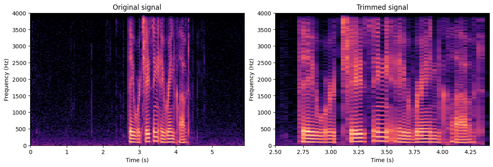

# Audio tools



These are some tools I typically use to work with audio. Some functionalities:

* Display audio
* Plot audio signals
* Compute spectrograms
* Display spectrograms

Check `quick_tutorial.ipynb` for a quick hands on.

## How to use:

0. **Before installing any dependencies I suggest you to create a Python virtual environment:**

`````
python3 -m venv .venv
source .venv/bin/activate
`````

1. **Clone the repo**: in a terminal, run

````
git clone https://github.com/davidvaldiviad/audio_tools.git
````

2. **Install the module** Then do:

`````
pip install -e ./audio_tools
`````

3. **Usage in Python** Simply write:

`````
import audio_tools
`````

More to come! I'll gladly receive feedback and suggestions.
